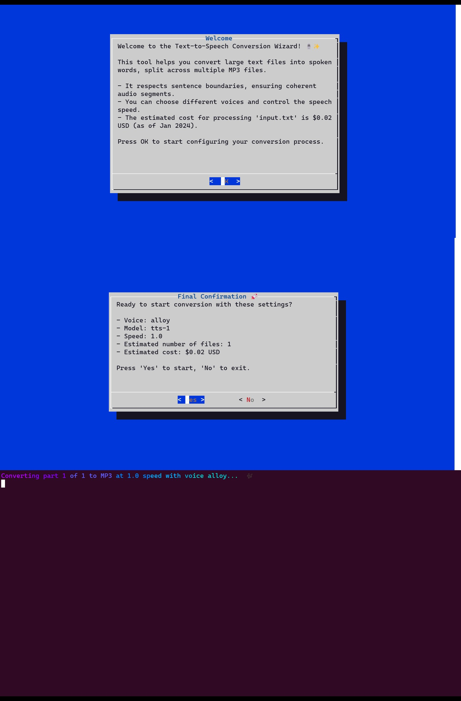

# 📖 AI-Audiobook-Maker 🎧

## Introduction
Welcome to the **AI-Audiobook-Maker**! 🚀 

This free tool transforms your books, textbooks, or any text document into fantastic sounding audiobooks using OpenAI's state-of-the-art TTS technology. 

Say goodbye to expensive subscriptions on shitty sites, crappy TTS, and other junk, and embrace the freedom of creating audiobooks on demand via API. 🌟

## Features
- 📘 **Versatile Text Conversion**: From books to articles, convert any text to audio.
- 🎙️ **Diverse Voice Options**: A wide range of voices to suit your preference.
- 🎚️ **Speed Customization**: Control the narration speed for optimal listening.
- 📊 **Transparent and Affordable Pricing**: Pay as you go without hidden costs via OpenAI.
- 🛠️ **Open Source and Customizable**: Freedom to modify and enhance.

## Pricing
Simple, pay-per-use pricing (provided by OpenAI API):

Rough costs as of Jan 2024:
| Text Length                      | Estimated Cost | Context                           |
|----------------------------------|----------------|-----------------------------------|
| 250 words                        | $0.01875       | Average email                     |
| 500 words                        | $0.0375        | Average letter                    |
| 1,000 words                      | $0.075         | Blog post, short article          |
| 2,500 words                      | $0.1875        | Long article, short report        |
| 5,000 words                      | $0.375         | Research paper, short story       |
| 10,000 words                     | $0.75          | Long story, small e-book          |
| 25,000 words                     | $1.875         | Novella, thesis                   |
| 50,000 words (average novel)     | $3.75          | Approximate average book length   |
| 100,000 words                    | $7.50          | Long novel, comprehensive guide   |
| 200,000 words                    | $15.00         | Epic novel, extensive research    |


| Number of Characters | Estimated Cost | Context                            |
|----------------------|----------------|------------------------------------|
| 1,000                | $0.015         | Short email, brief memo            |
| 5,000                | $0.075         | Average email, short article       |
| 10,000               | $0.15          | Detailed report, newsletter        |
| 25,000               | $0.375         | Long article, short story          |
| 50,000               | $0.75          | Extensive report, small e-book     |
| 100,000              | $1.50          | Comprehensive guide, long story    |
| 250,000              | $3.75          | Novella, academic thesis           |
| 500,000              | $7.50          | Full-length novel, extensive guide |
| 1,000,000            | $15.00         | Epic novel, in-depth analysis      |


**Example**: Converting "Fuzzing The Machine" (240 pages) cost approximately $5.50. 📘💰

## How It Works
1. **Prepare Your Text**: Have your text file ready.
2. **Run the AI-Audiobook-Maker**: Follow the simple wizard.
3. **Choose Settings**: Select voice and speed.
4. **Convert**: Watch as your text becomes an audiobook.
5. **Listen and Enjoy**: On your favorite device!

## Getting Started
```bash
git clone https://github.com/wowitsjack/AI-Audiobook-Maker.git
cd AI-Audiobook-Maker
./audiobook_maker.sh
```

## Dependencies (The script ahould handle this, yo)
- `dialog`: For user interface.
- `lolcat`: For colorful terminal output.
- `ffmpeg`: For audio file processing.
- `ospeak`: OpenAI's text-to-speech CLI tool.



## Contributing
Contributions make the open-source community thrive. Your contributions are **deeply appreciated**.

## License
Distributed under the MIT License. See `LICENSE`.

## Contact
Don't.

## Badges
## Badges

[](https://github.com/wowitsjack/AI-Audiobook-Maker)
[](https://github.com/wowitsjack/AI-Audiobook-Maker/fork)
[](https://github.com/wowitsjack/AI-Audiobook-Maker)
[](https://github.com/wowitsjack)

